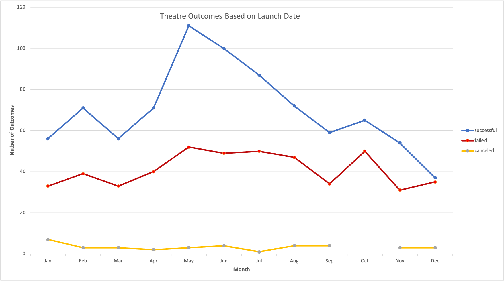
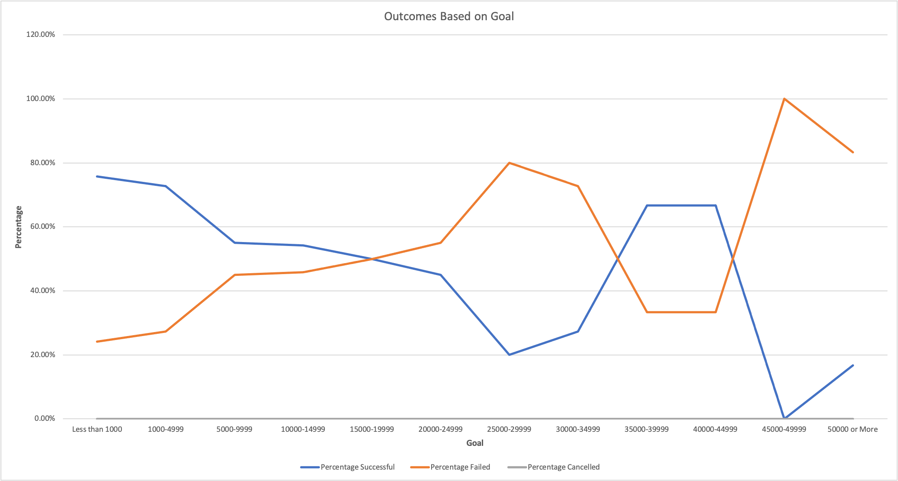

# kickstarter-analysis
Performing an analysis on Kickstarter Data to uncover trends 

## Overview of Project

### Purpose
&nbsp;&nbsp;&nbsp;&nbsp;&nbsp;&nbsp; After organizing her own fundraiser and making traget goals louise has hired an analytics 
firm to examine other successful and failed fundraising projects to provide insights into trends that may be of beneficial use within future projects. 

&nbsp;&nbsp;&nbsp;&nbsp;&nbsp;&nbsp;Our job as the analyst is to 
employ the use of excel visualization tools and formulae to organise the data into a 
user friendly format that is easy for the customer (louise) to extract information at a glance based on the relationship they hold specific to individualized parameters (e.g. launch dates and funding goals)

## Analysis and Challenges

### Analysis of Outcomes Based on Launch Date
&nbsp;&nbsp;&nbsp;&nbsp;&nbsp;&nbsp;An analysis of outcomes as determined relative to the theatres launch date revealed that there was a relatively low likelihood of cancellation thorough out the year (as depicted by the yellow line at the bottom of the graph). Examination of the blue nad red line graphs (indicating chances of success and failure respectively) appeared to move together with the highest chnace of success compared to failure seeming to be present during the spring/summer months. While this relationship maybe causal due to the effect of a more pleasant climate, we cannot assume so as a correlative link might also exist since the spring/summer months indicated a general higher average of hosted events and so inherently presents with a higer average of successful/failed outcomes.

### Analysis of Outcomes Based on Goals
&nbsp;&nbsp;&nbsp;&nbsp;&nbsp;&nbsp;An analysis of outcomes based on goals was charted using a line graph (as seen below) and examined to reveal a couple interesting facts:

1. the lower the target goal the higher the chance of success 

2. as target goals increased the chances of faliure did too indicating an inverse relationship between the two
 
3. chances of faliure and success coincided at 3 distinct points implying a 50% likelihood of eaither faliure or success

4. Interestingly enough there was a far higher chance of success when fundraising for a kickstarter in the range of $35,000-$44,999 as compared to faliure though the total number of projects sampled in that range were quite minimal and so this sample subset examined may not be accurately indicative of what may actually happen if applied to the population should everyone start fundraising with that goal in mind.

### Challenges and Difficulties Encountered
&nbsp;&nbsp;&nbsp;&nbsp;&nbsp;&nbsp;Most of the formulae and scripting used within this projeect were items that ive had a great deal of personal experience in, thoughh im able to understand how some of my peers had troubles in the follwing:
- typing/using the correct forlumae in order to acheive desired goals whether it be the function use itself or the syntax of the formula
- Not fixing reference tables and recieving #N/A result errors
- pivot tables not being assigned their correct headers/values 

Personally two "errors" I encountered were with regards to the Vlookup function as well as nested if furmulas:
- When using Vlookup/nested "if"/COUNTIFS to fill in subcategory statistics as well as relavent feilds within the master data set and Ouctomes based on Goals sheet, unfamiliarity of the sytax in which it should have been written led me through a couple iterations of troubleshooting

## Results

- What are two conclusions you can draw about the Outcomes based on Launch Date?

- What can you conclude about the Outcomes based on Goals?

- What are some limitations of this dataset?

- What are some other possible tables and/or graphs that we could create?
